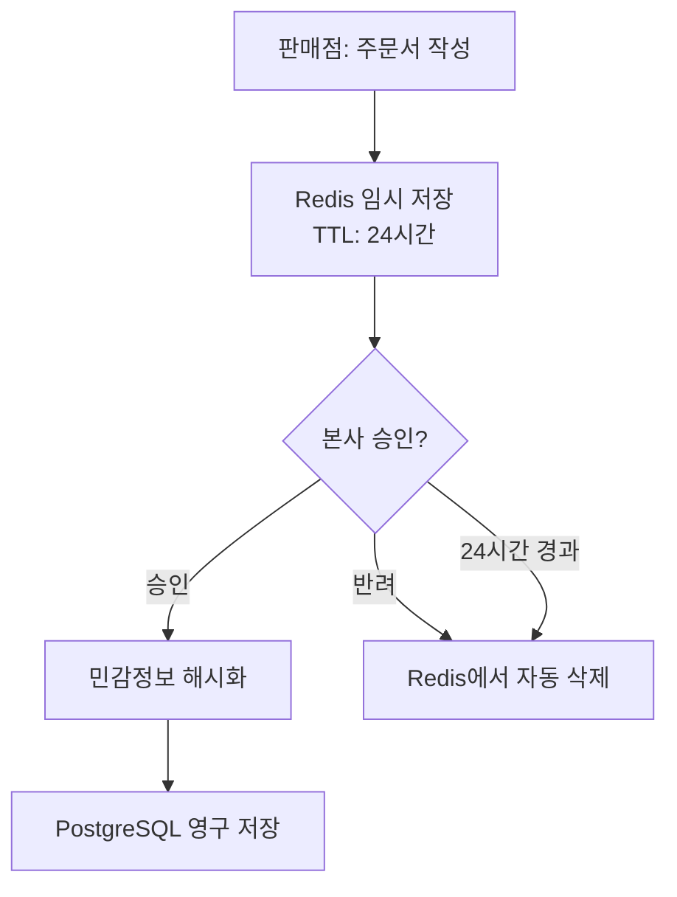

# DN_SOLUTION2 리팩토링 상세 명세서

## 🎯 프로젝트 목표 및 제약사항

### 비즈니스 목표
1. **핵심 목표**: 휴대폰 도매업 B2B SaaS 플랫폼
2. **사용자**: 본사(1개) → 협력사(N개) → 판매점(N개)
3. **핵심 프로세스**: 정책 생성 → 주문서 작성 → 승인 → 정산

### 기술적 제약사항
1. **Python 버전**: 3.11+ (현재 설치된 버전 유지)
2. **Django 버전**: 4.2.7 (변경 불가)
3. **React 버전**: 19.1.1 (변경 불가)
4. **데이터베이스**: PostgreSQL 15 (Docker), SQLite (개발)
5. **배포 환경**: 가상서버 (4 vCPU, 8GB RAM)

## 📊 데이터베이스 스키마 요구사항

### 1. Companies 앱 (현재 구현됨 - 수정 불필요)
```python
Company:
  - id (UUID)
  - code (자동생성: A-YYMMDD-01)
  - name
  - type (headquarters|agency|retail)
  - parent_company (FK)
  - status
  - visible

CompanyUser:
  - id (UUID)
  - company (FK)
  - django_user (OneToOne)
  - username
  - role (admin|staff)
  - is_approved
  - status (pending|approved|rejected)
```

### 2. Policies 앱 (리팩토링 필요)

#### 현재 문제점
- 리베이트가 단순 필드로만 구현 (rebate_agency, rebate_retail)
- 주문서 양식 빌더 미구현

#### 필요한 모델 구조
```python
Policy:
  - 기존 필드 유지
  - rebate_agency, rebate_retail 제거 (RebateMatrix로 대체)

RebateMatrix (신규):
  - id (UUID)
  - policy (FK)
  - carrier (SKT|KT|LG U+)
  - plan_range (30000|50000|70000|100000)  # 요금제 구간
  - contract_period (3|6|9|12)  # 개월
  - rebate_amount (Decimal)
  
  class Meta:
    unique_together = ['policy', 'carrier', 'plan_range', 'contract_period']

OrderFormTemplate (수정):
  - id (UUID)
  - policy (OneToOne)
  - template_json (JSONField)  # 양식 구조 저장
  - created_by (FK User)
  
  # template_json 예시:
  {
    "fields": [
      {
        "name": "customer_name",
        "label": "고객명",
        "type": "text",
        "required": true,
        "is_sensitive": true  # 민감정보 여부
      },
      {
        "name": "phone",
        "label": "전화번호",
        "type": "tel",
        "required": true,
        "is_sensitive": true,
        "validation": "^010-\\d{4}-\\d{4}$"
      },
      {
        "name": "carrier",
        "label": "통신사",
        "type": "select",
        "options": ["SKT", "KT", "LG U+"],
        "required": true
      },
      {
        "name": "plan_type",
        "label": "요금제",
        "type": "select",
        "options": ["3만원대", "5만원대", "7만원대", "10만원대"],
        "required": true
      },
      {
        "name": "contract_period",
        "label": "약정기간",
        "type": "select",
        "options": ["3개월", "6개월", "9개월", "12개월"],
        "required": true
      },
      {
        "name": "application_url",
        "label": "신청 URL",
        "type": "url",
        "required": true
      }
    ]
  }
```

### 3. Orders 앱 (리팩토링 필요)

#### 필요한 모델 구조
```python
Order (수정):
  - 기존 필드 유지
  - form_data (JSONField)  # 주문서 데이터
  - sensitive_data_key (CharField)  # Redis 키 (승인 전)
  - is_sensitive_data_processed (Boolean)  # 민감정보 처리 완료 여부
  
OrderSensitiveData (신규):
  - id (UUID)
  - order (OneToOne)
  - customer_name_hash (CharField)  # SHA-256 해시
  - customer_phone_hash (CharField)
  - customer_email_hash (CharField)
  - encrypted_data (TextField)  # 암호화된 전체 데이터
```

### 4. Settlements 앱 (신규 생성 필요)

```python
Settlement:
  - id (UUID)
  - order (FK)
  - company (FK)
  - settlement_type (rebate|margin|total)
  - amount (Decimal)
  - status (pending|approved|paid)
  - approved_by (FK User, null=True)
  - approved_at (DateTime, null=True)
  - created_at
  - updated_at

SettlementBatch:
  - id (UUID)
  - batch_number (CharField, unique)  # SETTLE-YYYYMM-001
  - company (FK)
  - period_start (Date)
  - period_end (Date)
  - total_amount (Decimal)
  - status (draft|submitted|approved|paid)
  - created_at
  - updated_at
```

## 🔄 API 엔드포인트 명세

### 1. 정책 관리 API

```python
# 정책 CRUD
GET    /api/policies/                    # 정책 목록 (권한별 필터링)
POST   /api/policies/                    # 정책 생성 (본사만)
GET    /api/policies/{id}/               # 정책 상세
PUT    /api/policies/{id}/               # 정책 수정 (본사만)
DELETE /api/policies/{id}/               # 정책 삭제 (본사만)

# 리베이트 매트릭스
GET    /api/policies/{id}/rebate-matrix/ # 매트릭스 조회
POST   /api/policies/{id}/rebate-matrix/ # 매트릭스 설정
PUT    /api/policies/{id}/rebate-matrix/ # 매트릭스 수정

# 주문서 양식
GET    /api/policies/{id}/form-template/ # 양식 조회
POST   /api/policies/{id}/form-template/ # 양식 생성
PUT    /api/policies/{id}/form-template/ # 양식 수정

# 정책 배정
POST   /api/policies/{id}/assign/        # 협력사에 배정
DELETE /api/policies/{id}/assign/{company_id}/ # 배정 해제
GET    /api/policies/assigned/           # 배정받은 정책 목록
```

### 2. 주문 관리 API

```python
# 주문 CRUD
GET    /api/orders/                      # 주문 목록
POST   /api/orders/                      # 주문 생성 (판매점)
GET    /api/orders/{id}/                 # 주문 상세
PUT    /api/orders/{id}/                 # 주문 수정 (승인 전까지)
DELETE /api/orders/{id}/                 # 주문 삭제 (승인 전까지)

# 주문 승인
POST   /api/orders/{id}/approve/         # 주문 승인 (본사)
POST   /api/orders/{id}/reject/          # 주문 반려 (본사)

# 민감정보 처리
GET    /api/orders/{id}/sensitive-data/  # 민감정보 조회 (권한 체크)
POST   /api/orders/{id}/process-sensitive/ # 민감정보 처리
```

### 3. 정산 관리 API

```python
# 정산 조회
GET    /api/settlements/                 # 정산 목록
GET    /api/settlements/{id}/            # 정산 상세
GET    /api/settlements/dashboard/       # 정산 대시보드

# 정산 처리
POST   /api/settlements/calculate/       # 정산 계산
POST   /api/settlements/{id}/approve/    # 정산 승인
POST   /api/settlements/batch/           # 일괄 정산

# 정산 보고서
GET    /api/settlements/report/monthly/  # 월별 보고서
GET    /api/settlements/report/company/{id}/ # 업체별 보고서
```

## 🔐 권한 매트릭스

### 기능별 권한 표
| 기능 | 본사 | 협력사 | 판매점 |
|------|------|--------|--------|
| **정책** |
| 정책 생성/수정/삭제 | ✅ | ❌ | ❌ |
| 정책 조회 | ✅ (전체) | ✅ (배정된 것) | ✅ (배정된 것) |
| 주문서 양식 설계 | ✅ | ❌ | ❌ |
| 리베이트 매트릭스 설정 | ✅ | ❌ | ❌ |
| **주문** |
| 주문서 작성 | ❌ | ❌ | ✅ |
| 주문서 수정/삭제 | ❌ | ❌ | ✅ (승인 전) |
| 주문 승인/반려 | ✅ | ❌ | ❌ |
| 주문 조회 | ✅ (전체) | ✅ (하위) | ✅ (본인) |
| **정산** |
| 정산 승인 | ✅ | ❌ | ❌ |
| 정산 조회 | ✅ (전체) | ✅ (본인+하위) | ✅ (본인) |
| **업체 관리** |
| 하위 업체 생성 | ✅ | ✅ | ❌ |
| 사용자 승인 | ✅ | ✅ (하위만) | ❌ |

## 🔒 민감정보 처리 플로우



### 구현 상세
```python
# core/sensitive_data.py
class SensitiveDataManager:
    SENSITIVE_FIELDS = ['customer_name', 'customer_phone', 'customer_email', 'customer_address']
    
    def store_temporary(self, order_id, data):
        """Redis에 임시 저장"""
        key = f"order:sensitive:{order_id}"
        # 민감정보만 추출
        sensitive_data = {k: v for k, v in data.items() if k in self.SENSITIVE_FIELDS}
        # Redis 저장 (TTL 24시간)
        redis_client.setex(key, 86400, json.dumps(sensitive_data))
        return key
    
    def process_and_store(self, order_id):
        """승인 시 해시화하여 영구 저장"""
        key = f"order:sensitive:{order_id}"
        data = redis_client.get(key)
        if data:
            sensitive_data = json.loads(data)
            # 해시화
            hashed_data = {
                f"{k}_hash": hashlib.sha256(v.encode()).hexdigest()
                for k, v in sensitive_data.items()
            }
            # DB 저장
            OrderSensitiveData.objects.create(
                order_id=order_id,
                **hashed_data
            )
            # Redis 삭제
            redis_client.delete(key)
    
    def mask_for_logging(self, data):
        """로그용 마스킹"""
        masked = data.copy()
        for field in self.SENSITIVE_FIELDS:
            if field in masked:
                value = masked[field]
                if field == 'customer_name':
                    masked[field] = value[0] + '*' * (len(value) - 1) if value else ''
                elif field == 'customer_phone':
                    masked[field] = value[:4] + '****' + value[-4:] if len(value) >= 8 else '****'
        return masked
```

## 📁 디렉토리 구조 변경 계획

```
DN_Solution2/
├── core/                    # 신규: 공통 모듈
│   ├── models.py           # AbstractBaseModel
│   ├── permissions.py      # 중앙화된 권한 시스템
│   ├── sensitive_data.py   # 민감정보 처리
│   ├── cache_manager.py    # 캐시 전략
│   └── exceptions.py       # 커스텀 예외
├── settlements/            # 신규: 정산 앱
│   ├── models.py
│   ├── views.py
│   ├── serializers.py
│   └── tasks.py           # Celery 태스크
├── companies/              # 유지
├── policies/               # 리팩토링
│   ├── models.py          # RebateMatrix 추가
│   ├── form_builder.py    # 신규: 양식 빌더
│   └── views.py           # API 추가
├── orders/                 # 리팩토링
│   ├── models.py          # 민감정보 필드 추가
│   └── views.py           # 승인 프로세스 수정
├── inventory/              # 삭제
├── messaging/              # 삭제
└── frontend/
    ├── src/
    │   ├── services/       # 신규: API 서비스 레이어
    │   ├── store/         # 신규: 상태 관리 (Redux/Zustand)
    │   └── components/
    │       ├── FormBuilder/  # 신규: 양식 빌더 컴포넌트
    │       └── Dashboard/    # 수정: 정산 대시보드 추가
```

## 🧪 테스트 시나리오

### 1. 민감정보 처리 테스트
```python
# tests/test_sensitive_data.py
def test_sensitive_data_flow():
    # 1. 주문 생성 (민감정보 포함)
    # 2. Redis 저장 확인
    # 3. 24시간 후 자동 삭제 확인
    # 4. 승인 시 해시화 저장 확인
    # 5. 로그 마스킹 확인
```

### 2. 리베이트 매트릭스 테스트
```python
# tests/test_rebate_matrix.py
def test_rebate_calculation():
    # 1. 매트릭스 생성
    # 2. 요금제별 리베이트 계산
    # 3. 정산 금액 검증
```

### 3. 권한 테스트
```python
# tests/test_permissions.py
def test_hierarchy_permissions():
    # 1. 본사 → 모든 데이터 접근
    # 2. 협력사 → 하위 데이터만 접근
    # 3. 판매점 → 본인 데이터만 접근
```

## 🚀 마이그레이션 전략

### 1단계: 백업
```bash
# 데이터베이스 백업
python manage.py dumpdata > backup_$(date +%Y%m%d).json
pg_dump dn_solution2 > backup_$(date +%Y%m%d).sql
```

### 2단계: 새 모델 추가
```bash
# core 앱 생성
python manage.py startapp core

# settlements 앱 생성
python manage.py startapp settlements

# 마이그레이션 생성
python manage.py makemigrations
```

### 3단계: 데이터 마이그레이션
```python
# migrations/0002_migrate_rebate_data.py
def migrate_rebate_to_matrix(apps, schema_editor):
    Policy = apps.get_model('policies', 'Policy')
    RebateMatrix = apps.get_model('policies', 'RebateMatrix')
    
    for policy in Policy.objects.all():
        # 기존 rebate_agency, rebate_retail을 매트릭스로 변환
        for carrier in ['SKT', 'KT', 'LG U+']:
            for plan in [30000, 50000, 70000, 100000]:
                for period in [3, 6, 9, 12]:
                    RebateMatrix.objects.create(
                        policy=policy,
                        carrier=carrier,
                        plan_range=plan,
                        contract_period=period,
                        rebate_amount=policy.rebate_agency  # 임시 마이그레이션
                    )
```

### 4단계: 검증
```bash
# 마이그레이션 테스트
python manage.py migrate --dry-run

# 실제 마이그레이션
python manage.py migrate

# 데이터 검증
python manage.py shell
>>> from policies.models import RebateMatrix
>>> RebateMatrix.objects.count()
```

## ⚠️ 주의사항 및 리스크

### 1. 데이터 손실 방지
- 모든 마이그레이션 전 백업 필수
- 스테이징 환경에서 먼저 테스트
- 롤백 계획 수립

### 2. 하위 호환성
- API 버전 관리 (/api/v1/, /api/v2/)
- 기존 API는 deprecated 처리 후 유지
- Frontend 점진적 마이그레이션

### 3. 성능 영향
- 리베이트 매트릭스 인덱스 최적화 필수
- 캐시 전략 사전 테스트
- 부하 테스트 수행

### 4. 보안 체크리스트
- [ ] 민감정보 암호화 키 관리
- [ ] Redis 접근 제어
- [ ] 로그 마스킹 검증
- [ ] SQL Injection 방지
- [ ] XSS 방지

## 📈 성공 지표

### 기술적 지표
- API 응답 시간 < 100ms (95 percentile)
- 동시 사용자 1,500명 지원
- 가용성 99.9%
- 민감정보 유출 0건

### 비즈니스 지표
- 주문 처리 시간 50% 단축
- 정산 오류율 0.1% 이하
- 사용자 만족도 90% 이상

## 🔄 롤백 계획

```bash
# 1. 서비스 중단
docker-compose down

# 2. 이전 버전 복원
git checkout previous-version
docker-compose build

# 3. 데이터베이스 복원
psql dn_solution2 < backup_20241224.sql

# 4. 서비스 재시작
docker-compose up -d

# 5. 헬스체크
curl http://localhost:8000/health/
```

---

**문서 버전**: 1.0
**작성일**: 2024-12-24
**목적**: 클로드코드 리팩토링 가이드
**다음 검토일**: 2025-01-01
